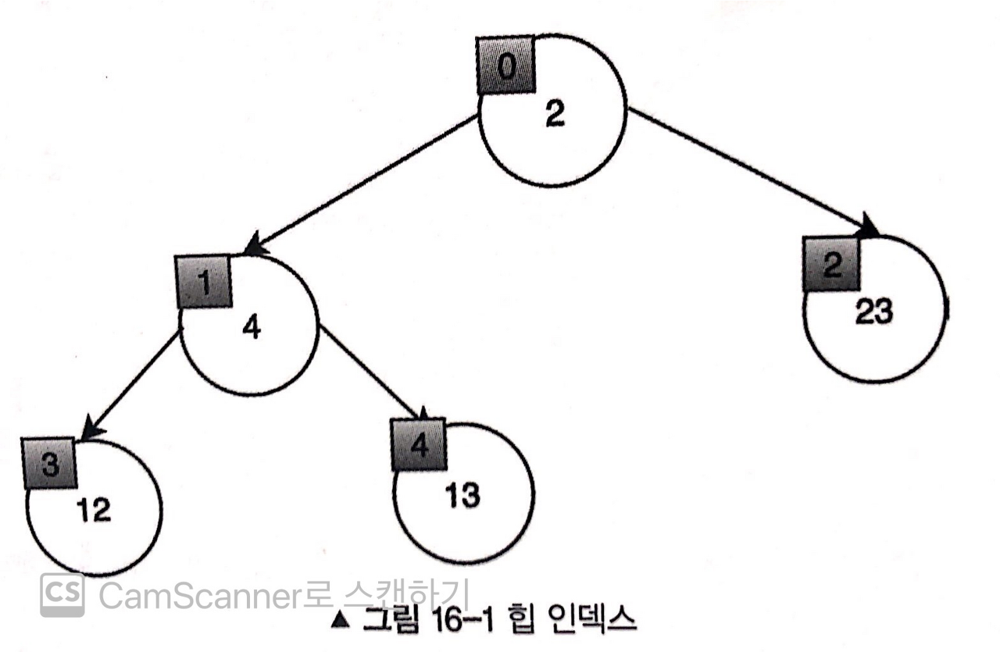

# 힙(Heap)

## 1. 힙(Heap)

- `우선순위 큐`를 구현하기 위해 만들어진 자료구조
- 완전 이진 트리 자료구조의 일종
- 삽입과 삭제에 O(logN)의 시간이 소요
- **최대 힙과 최소 힙으로 구분**

  - : 최댓값이나 최솟값을 찾아내는 연산을 빠르게 하기 위해 고안된 자료구조

  ### 우선순위 큐

  - 우선순위가 가장 높은 데이터를 가장 먼저 삭제하는 자료형
  - 데이터를 우선순위에 따라 처리하고 싶을 때 사용

    | 자료구조        | 추출되는 데이터             |
    | --------------- | --------------------------- |
    | **스택**        | 가장 나중에 삽입된 데이터   |
    | **큐**          | 가장 먼저 삽입된 데이터     |
    | **우선순위 큐** | 가장 우선순위가 높은 데이터 |

## 2. 최대 힙(Max Heap)과 최소 힙(Min Heap)

### 2-1. 최대 힙(Max Heap)

- 루트 노드가 최댓값을 가짐
  - 값이 가장 큰 데이터가 우선적으로 제거
- 모든 노드가 자식 노드보다 크거나 같은 값을 가지는 힙

### 2-2. 최소 힙(Min Heap)

- 루트 노드가 최솟값을 가짐
  - 값이 가장 작은 데이터가 우선적으로 제거
- 모든 노드가 자식 노드보다 작거나 같은 값을 가지는 힙

## 3. 힙(Heap) 구현하기 in JavaScript

### 3-1. 노드 간의 관계



```
- 현재 노드: N
- 부모 노드: Math.floor(N-1)/2
- 왼쪽 자식 노드: (N*2)+1
- 오른쪽 자식 노드: (N*2)+2
```

<!-- ### 3-2. 최소 힙(Max Heap) 구현

#### 클래스 정의

```js
class Heap {
  constructor() {
    this.heap = [];
  }
}
``` -->

### 3-2. 최소 힙(Min Heap) 구현

#### 클래스 및 메서드 정의

```js
class MinHeap {
  constructor() {
    this.heap = [];
  }

  // 두개의 값을 바꾸는 메서드
  swap(idx1, idx2) {
    [this.heap[idx1], this.heap[idx2]] = [this.heap[idx2], this.heap[idx1]];
  }
}
```

#### 삽입 연산

```js
add(value) {
    this.heap.push(value); // 힙에 새로운 노드 추가(맨 마지막에 추가됨)
    this.heapifyUp(); // 새로운 값이 수행할 함수
}

heapifyUp() {
    let index = this.heap.length - 1; // 새로운 노드의 위치
    let parentIdx = Math.floor((index - 1) / 2); // 부모 노드의 위치
    while (
        index > 0 && this.heap[index] < this.heap[parentIdx]
    ) {
        this.swap(index, parentIdx); // 두 노드의 값 교체
        index = parentIdx;
        parentIdx = Math.floor((index - 1) / 2); // 새로운 부모 노드의 인덱스 계산
    }
}
```

#### 삭제 연산

```
<삭제 연산의 순서>

1. 최솟값(= 루트 노드) 제거
2. 맨 마지막에 있는 노드를 루트 노드로 이동
3. 새로운 루트 노드와 자식 노드의 값을 비교해서 자식 노드가 더 작다면 위치를 교환
4. 값의 비교 반복
```

<br/>

```js
poll() {
    if(this.heap.length == 1) { // 힙의 크기가 1인 경우 (=힙에 남아있는 유일한 요소가 최솟값)
        return this.heap.pop(); // 힙에서 값을 삭제하고, 그 값을 return
    }

    const value = this.heap[0] // 힙의 최솟값(루트 노드) 저장
    this.heap[0] = this.heap.pop(); // 힙의 마지막 요소를 제거하고, 반환되는 값을 루트 노드에 저장
    this.heapifyDown(); // 루트 노드에서 수행할 함수 (자식 노드와 값을 비교)
    return value; // 삭제한 최소값 return
}

heapifyDown() {
    let index = 0; // 루트 노드
    let size = this.heap.length;
    let leftIdx = (index * 2) + 1 // 왼쪽 자식 노드
    let rightIdx = (index * 2) + 2 // 오른쪽 자식 노드

    while (
        leftIdx < size
        // 왼쪽 자식 인덱스가 힙 크기보다 작을 때
    ) {
        // 왼쪽 자식 노드와 오른쪽 자식 노드 중에서 더 작은 값을 찾기 위한 단계
        let smallerIdx = leftIdx; // 1. 왼쪽 노드가 더 작다고 가정
        if (
            rightIdx < size && this.heap[rightIdx] < this.heap[leftIdx]
            // 2. 오른쪽 노드가 더 작다면
        ) {
            smallerIdx = rightIdx; // smaller 노드를 오르쪽 노드로 변경

        // 자식 노드(왼,오) 중에 smallerIdx를 찾은 뒤 부모 노드와 교체

        if (this.heap[index] <= this.heap[smallerIdx]) {
            break;
        }

        this.swap(index, smallerIdx); // 두 노드의 값을 교체
        index = smallerIdx; // index를 더 작은 값의 자식 노드의 index로 변경
        leftIdx = index * 2 + 1; // 왼쪽 자식 노드의 index 계산
        rightIdx = index * 2 + 2; // 오른쪽 자식 노드의 index 계산
        }
    }
}
```

</br>

**<참고>** </br>
https://www.youtube.com/watch?v=AjFlp951nz0

https://chamdom.blog/heap-using-js/

https://nyang-in.tistory.com/153

https://haruisshort.tistory.com/293
